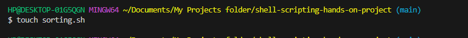

# Auxillary Project: Shell Scripting

### Shell script helps you atomate repetitive tasks. Bash scripts are essentially a series of commands and instructions that are executed sequentially in a shell. This script is created by saving a collection of commands in a text file with a   .sh extension.

1. VARIABLE
#name="Millicent"
#echo $name

2. ECHO COMMAND
#echo Hello Millicent! How are you doing today?

3. CONTROL FLOW

a. Using if-else to execute script based on a condition

`#!/bin/bash

#Example script to check if a number is positive, negative, or zero

read -p "Enter a number: " num

if [ $num -gt 0 ]; then
    echo "The number is positive."
elif [ $num -lt 0 ]; then
    echo "The number is negative."
else
    echo "The number is zero."
fi`

b. Iterating through a list using a for loop

#!/bin/bash

#Example script to print numbers from 1 to 5 using a for loop

for (( i=1; i<=5; i++ ))
do
    echo $i
done

4. Input and Output

a. Input
echo "Enter your name:"
read name

b. Out a result of a command into a file
`echo "hello world" > index.txt`

5. Functions
#!/bin/bash

#Define a function to greet the user
greet() {
    echo "Hello, $1! Nice to meet you."
}

#Call the greet function and pass the name as an argument
greet "John"

## Writing my proper shell script
I created a folder on my repository to save all the scripts

1. COMMAND

I created a file called user-input.sh using `touch user-input.sh` , change the ppermission of the file to be executable using `chmod +x user-input.sh` , run the command using `./user-input.sh`

2. DIRECTORY MANIPULATION AND NAVIGATION

I created a file called user-input.sh using `touch navigating-linux-filesyatem.sh` and pasted the script on inside the file.

Change the file permission using `chmod +x navigating-linux-filesystem.sh` and run the script using `./navigating-linux-filesystem.sh`

3. FILE OPERATIONS AND SORTING

I created a file called user-input.sh using `touch sorting.sh`

Pasted the script inside the file

Changed the permission on the file to be executable using `chmod +x sorting.sh`

Finally, run the script using `./sorting.sh`

4. WORKING WITH NUMBERS AND CALCULATION

I created a file called user-input.sh using `touch calculations.sh`

Pasted the script inside the file

Changed the permission on the file to be executable using `chmod +x calculations.sh`

Finally, run the script using `./calculations.sh`

5. FILE BACKUP AND TIMESTAMP

I created a file called user-input.sh using `touch backup.sh`

Pasted the script inside the file

Changed the permission on the file to be executable using `chmod +x backup.sh`

Finally, run the script using `./backup.sh`

THANK YOU!